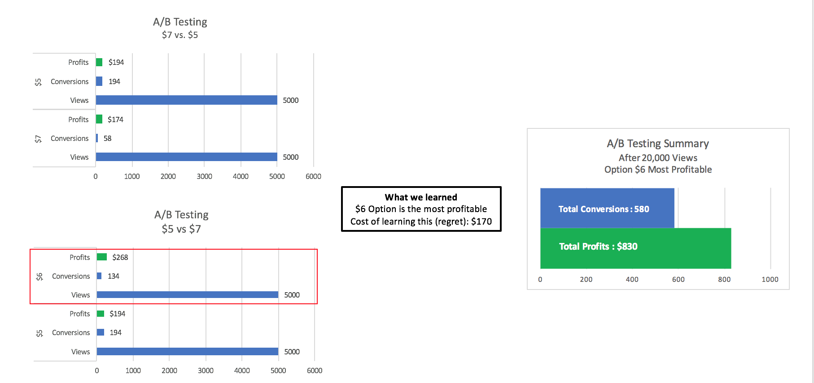
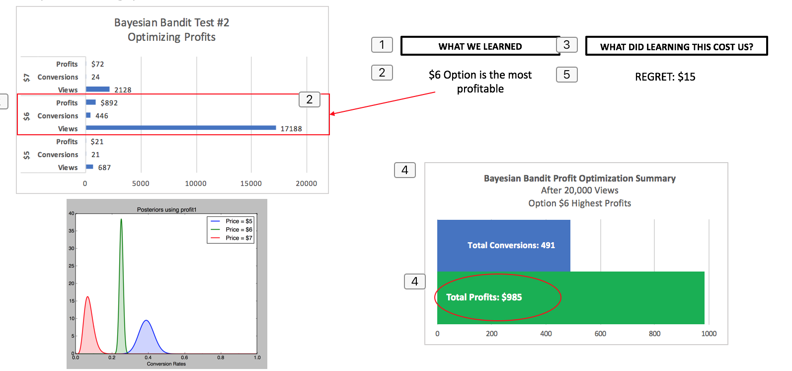
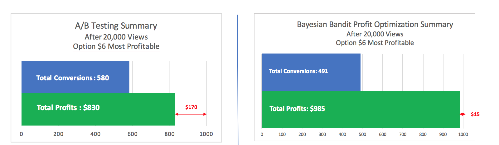

# Bayesian-Bandit-Price-Optimizer
Capstone Project for Galvanize Data Science Immersion Program

#The Inspiration for this project
After working for an eCommerce business their site’s revenue and conversion rates have been steadily falling over the past 3 years.  Current process for determining and implementing price changes are manual, slow, non-scientific and therefore thought to be the culprit of the falling revenue.  Also, capturing competitor pricing is manual, slow and error prone.

The goal of this project is to create a statistical engine using the multi-armed bandit that can be offered as a service to help companies find the best or most profitable action. 

#Data
Due to the sensitivity of this data it will not be published.  Mock data will be used in showing the testing results.
 - Sales and pricing data: OMS report from past 4 years of itemized sales, product cost and customer information.
 - Website data: Google analytics report of conversion rates for product pages
 - Competitor data: Built a webscraper to capture competitor prices 

#The Model
I built a multi-armed bandit engine that uses he Bayesian Bandit algorithm to optimize options.  The same test data will be used to compare results from my engine with results using the A/B testing method.

#The Test
Three price options will be tested to find the most profitable option.  The test data will be represented in the following way:

##AB Testing Results

##AB Bayesian Bandit Results

##SUMMARY OF RESULS

#Next Steps
 - Accommodate changing conversion rates over time.
 - Run a proof of concept to validate results

